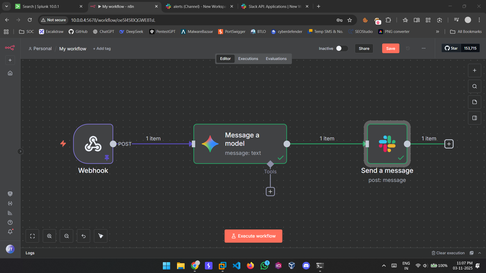
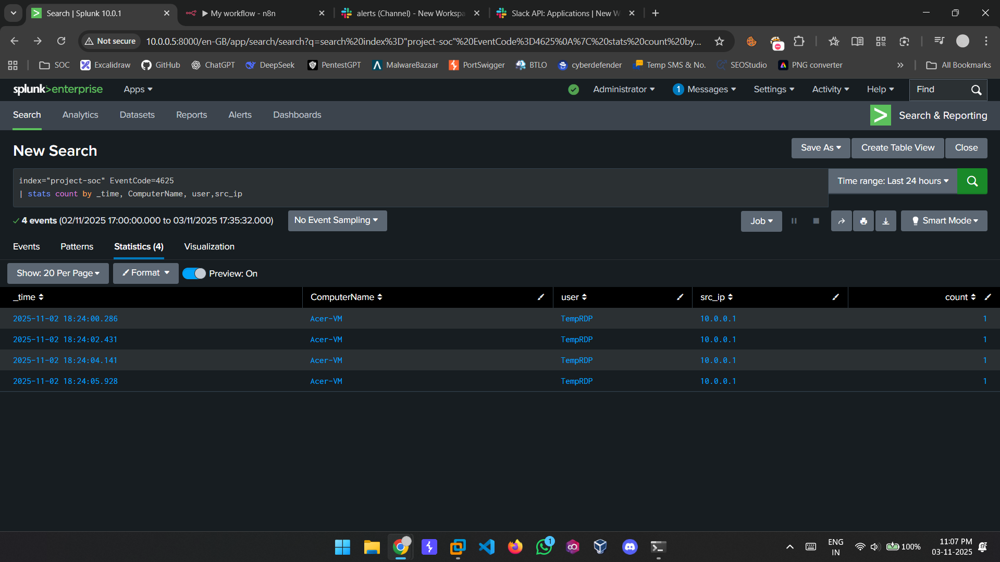
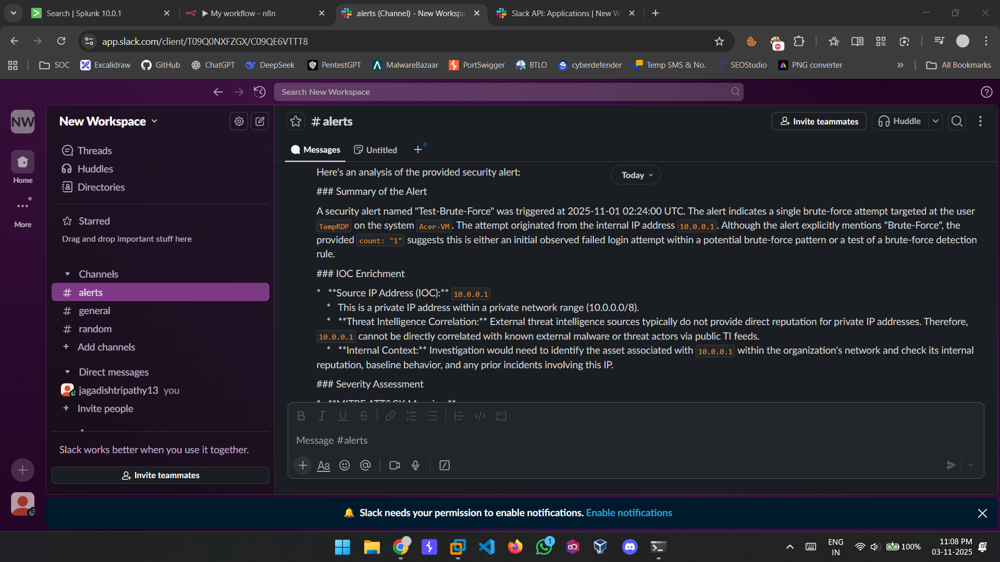

# SOC Automation

An AI-powered Security Operations Center (SOC) automation project that integrates **Splunk**, **n8n**, and **Gemini 2.5 Flash (Google AI)** to automatically analyze, enrich, and summarize security alerts in real time.

---

## Project Overview

Modern SOC environments deal with thousands of repetitive alerts daily.  
This project automates alert triage using AI — reducing manual analysis time and improving response efficiency.

When Splunk detects a **failed RDP login (EventCode 4625)**, it triggers a webhook to **n8n**, which forwards the alert data to **Gemini AI** for contextual analysis.  
The AI model evaluates the event, performs IOC enrichment, maps it to MITRE ATT&CK, and posts a detailed summary to **Slack**.

---

## ⚙️ Architecture

**Flow:**  
Splunk → n8n (Webhook) → Gemini 2.5 Flash → Slack  

**Components:**
- **Splunk Enterprise 10.0.1** – SIEM for event detection  
- **n8n** – Workflow automation and orchestration  
- **Gemini 2.5 Flash API** – AI engine for alert enrichment and analysis  
- **Slack** – Output destination for AI-generated incident summaries  
- **Ubuntu 24.04 LTS** – Host environment (VM)

---

## 🧩 Workflow Steps

1. **Detection:**  
   Splunk identifies EventCode 4625 (failed RDP logins).
   

3. **Automation Trigger:**  
   Splunk sends alert via webhook to n8n.

4. **AI Analysis:**  
   n8n forwards alert details to Gemini API, which returns:  
   - Event summary and context  
   - IOC enrichment  
   - MITRE ATT&CK mapping  
   - Threat severity  
   - Recommended actions

5. **Response:**  
   The AI-generated report is automatically posted to a dedicated Slack channel for SOC visibility.

---

## 📊 Example Output

**AI Response Example:**
> *Detected repeated failed RDP login attempts from IP 103.x.x.x. Classified as potential brute-force activity (MITRE T1110). Suggested action: block IP and monitor for further activity.*

---

## 💡 Key Benefits

- Automated alert triage  
- Real-time AI-driven analysis  
- Improved response accuracy  
- Reduces analyst workload  
- Bridges SIEM and SOAR capabilities  

---

## 🔮 Future Enhancements

- Integration with **Threat Intelligence APIs** (AbuseIPDB, VirusTotal, Shodan)  
- Automated remediation (firewall blocking, account disabling)  
- Daily summary reports and dashboards  

---

## 🧰 Tech Stack

| Component | Purpose |
|------------|----------|
| Splunk Enterprise 10.0.1 | SIEM & Log Correlation |
| n8n | Automation Workflow |
| Gemini 2.5 Flash | AI Model for Analysis |
| Slack | SOC Notification Channel |
| Ubuntu 24.04 LTS | Host OS |

---

## 📄 License

This project is open-sourced under the **MIT License**.  
You are free to use and modify it for educational and non-commercial purposes.

---

## 👤 Author

**Jagadish Tripathy**  
VAPT & SOC Analyst 
[LinkedIn Profile](https://linkedin.com/in/jagadishtripathy) • [GitHub](https://github.com/jagdishtripathy)

---
